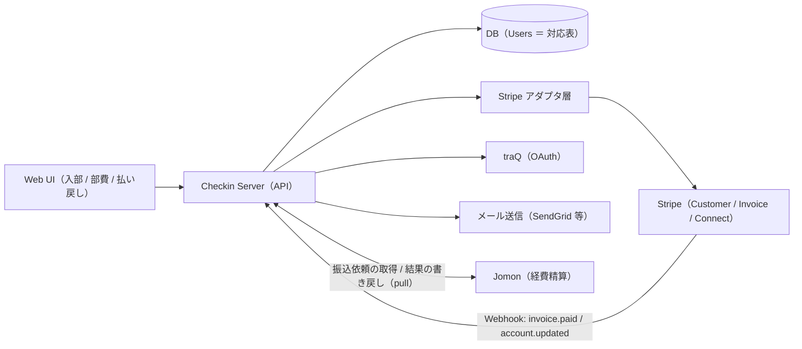
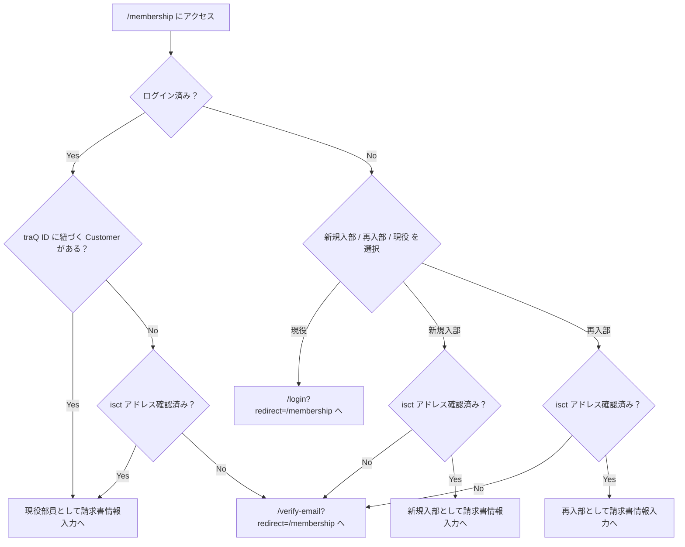
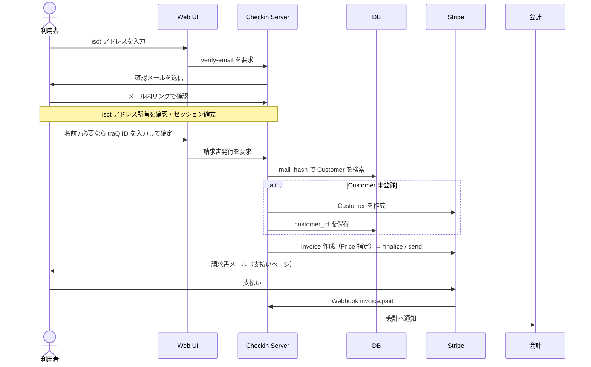
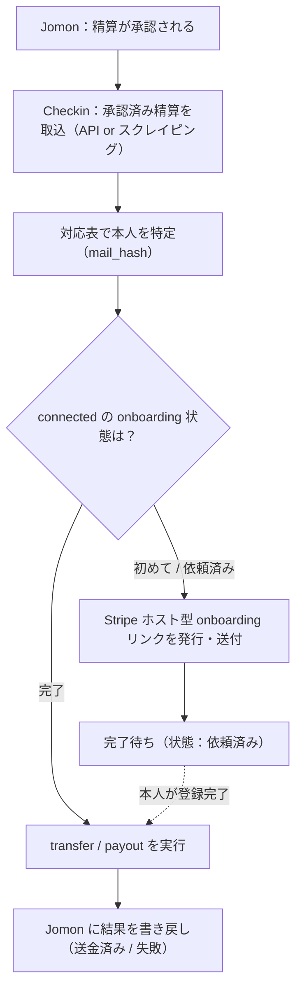
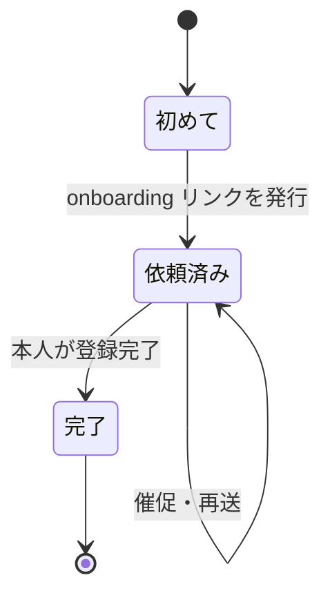

# Checkin（仮称）設計

> ステータス: 仕様整理中（第一弾スコープ確定）
> 最終更新: 2026-06-19

## 1. 概要と目的

traP の Stripe を使った **集金** と **払い戻し** をまとめて扱うシステム。実質的に入部フォームを兼ねられる。

第一弾スコープ:

1. 入部費 / 部費の集金（請求書ベース）
2. 入出金の一覧（会計用）
3. Jomon で承認された振込依頼を connected account を使って Stripe で実行（払い戻し）。**承認・申請は Jomon、Checkin は実行のみを担う。**

**原則: サークルが Stripe に依存せず、いつでも切り替えられること。** Stripe をオフにして口座振込を指示できるよう、ドメインと「人 ↔ Stripe オブジェクト」の対応表は **自前 DB を source of truth** とし、Stripe は薄いアダプタ越しに使う。

## 2. 基本方針（決定事項）

- **Stripe API は v1 を使う。Accounts v2 は当面採用しない。**
  - 欲しい統合（1 つの Account に customer〔請求先〕と recipient〔払い戻し先〕を同居させる）は今のところ public preview で、GA 日付の公表がなく breaking change も継続中。お金が外に出る処理を preview に乗せたくない。
  - 統合を実現する customer 構成が preview である以上、v2 に乗り換えても preview を踏まなければ結局 Customer と connected の 2 オブジェクトのままで、痛み（後述の対応表問題）が消えない。
  - 既に v1 Customer も connected も持っているので、移行ゼロで始められる。
- **対応表は自前 DB が正。** 人 → `{stripe_customer_id, stripe_connected_account_id, onboarding 状態}` を DB に持つことで、現状のスプレッドシート手作業を排除する。
- **本人識別キー = isct メールのハッシュ**（サービス内 ID、isct 限定）。集金側も払い戻し側も同じキーで 1 行に束ねる。メール平文は Stripe 側に保持。
- **商品は Price ID で指定**（Product ではなく）。入部費は前期 ¥4,000 / 後期 ¥2,000 を Price として用意し、機械的に切り替える。
- **認証**: 管理者（会計）は traQ OAuth ＋ traQ グループ／環境変数で認可。利用者は isct メールのマジックリンクでログインし、**セッションは httpOnly cookie ＋ double-submit CSRF（`__Host-checkin_csrf`）で保持**する（JWT クライアント保持案は不採用。traP の他サービス〔Jomon 等〕もセッション方式で一貫）。
- **将来**: Global Payouts / Accounts-v2-as-customers が GA になったら v2 統合への移行を検討（§10）。

## 3. 全体アーキテクチャ

ポイントは **Stripe アダプタ層** を境界にすること。ドメイン（誰がいくら払う／払い戻す）は Stripe 非依存に保ち、Stripe 呼び出しをアダプタに閉じ込めておけば、「Stripe オフ → 口座振込」への切り替えや、将来の v2 移行が**アダプタ差し替え**で済む。

## 4. データモデル

### 4.1 本人の表現

- サービス内は `mail_hash`（isct メールのハッシュ）で識別する。
- Stripe 側では、集金は **Customer**、払い戻しは **connected account** に分かれる。この 2 つを Users の 1 行で束ねるのが対応表の役割。
- 再入部時に入力された traQ ID は**信頼できない**（凍結中は所有確認ができないため、他人の存在する ID を打たれてもミスに気付けない）。よって Customer への保存・参照には使わず、アカウント復旧対象の記録のみに使う（§5.1）。

### 4.2 Stripe オブジェクトの対応

| 役割 | Stripe オブジェクト | 備考 |
| --- | --- | --- |
| 部費の請求先 | Customer | mail_hash で DB と対応付け |
| 請求書 | Invoice ＋ InvoiceItem（Price） | finalize / send で支払いページへ |
| 払い戻しの送金先 | Connected account（Connect） | JIT で onboarding |
| 入金検知 | Webhook `invoice.paid` | 会計へ通知 |
| onboarding 完了検知 | Webhook `account.updated`（新規） | 払い戻し可否の判定に使う |

## 5. 機能別フロー

### 5.1 集金（入部費 / 部費）

部員でなくても申請者は誰でも使える（新規入部）。再入部・現役部員にも対応する。

**`/membership` の振り分け**

**請求書の発行 → 入金 → 通知（共通）**

補足:

- **入部費の額**: 前期 ¥4,000 / 後期 ¥2,000 を Price として用意し、機械的に決定。
- **Customer の有無判定**: まず DB（mail_hash）→ 無ければ Stripe をメールで検索 → それでも無ければ作成し、`customer_id` を DB に保存する。
- **再入部の traQ ID 取り扱い（バグ回避）**: 入力された traQ ID は **存在チェックのみ** に使い、Customer への保存・参照はしない。アカウント復旧の対象設定だけに使う。ID 不明の場合は役員対応へ誘導。
- ログの可読性のため、Customer の `name` / `metadata` に traQ ID を入れるのは可（ただし参照キーには使わない）。

### 5.2 入出金一覧（会計のみ）

- **請求書由来**（`/list/invoices`）と **決済ページ由来**（`/list/checkout-sessions`）の 2 系統。
- フィルタ（status 等）＋ ページネーション。
  - 補足: invoice list は `status`（draft / open / paid / uncollectible / void）で絞れる（当初の「state で絞れない」懸念は不要）。checkout sessions も `status` / `customer` / `payment_intent` で絞れる。
- 各行に持つ項目: `id` / 金額 / 日時 / customer 参照（または traQ ID 等のデータ）/ 支払い状況 / 支払いの id（Dashboard URL を生成可）/ 商品参照。

### 5.3 払い戻し（Jomon 経費精算）

> 種別の明確化: これは Stripe の **refund（カード返金）ではない**。立て替えた人の口座へ送る **transfer / payout**。本人の本人確認＋口座登録（onboarding）が必須。

**onboarding の状態機械（JIT）**

補足:

- **onboarding は just-in-time**: 初回の払い戻し発生時に Stripe ホスト型 onboarding リンクを発行・送付する（Stripe も API onboarding より hosted / embedded を推奨）。完了後に送金。
- これがドキュメント当初の「初めて / 依頼したがまだ / 作成済み」の正式版。
- **onboarding 完了の検知（`account.updated` Webhook の取り回し）**: Stripe は「完了しました」という単発イベントを送ってこない。connected account の状態変化は `account.updated` で通知されるので、受信のたびに 署名検証 →（イベントの `account` で対象を特定）→ `payouts_enabled` などのフラグと未提出要件の有無で「払い出し可能か」を判定する。onboarding 中は何度も飛ぶため「来たら done」ではなく **フラグで判定** し、event id で **冪等** に状態を更新。`done` になったら `onboarding_waiting` だった払い戻しを実行に進める。
- **Jomon 連携は API（pull 方式）で行う**（[Jomon v2 API](https://apis.trap.jp/?urls.primaryName=Jomon%20v2%20API) 公開済み、スクレイピング不要）。**責任分界は確定**: 承認・申請は Jomon、Checkin は connected account を使った払い戻しの **実行のみ**。Checkin が Jomon から承認済みの振込依頼（誰に・いくら）を取得 → Stripe で onboarding／送金 → 結果（送金済み / 失敗）を Jomon に書き戻す（[Issue #183](https://github.com/traPtitech/Jomon/issues/183) と整合）。即時性は不要なので pull で十分。**認証は Bearer サービストークン**（Checkin → Jomon の片方向、スコープ最小 ＋ 内部ネットワーク制限）。
- **資金繰り（残高補填）は本スコープ外**。

## 6. API 設計

| メソッド・パス | 用途 | 認可 |
| --- | --- | --- |
| `GET /csrf` | CSRF cookie 発行 | 公開 |
| `POST /verify-email` | isct メール確認メール送信 | 公開 |
| `GET /verify-email/confirm` | 確認ページ表示 | 公開（トークン） |
| `POST /verify-email/confirm` | トークン消費・ログイン確立 | 公開（トークン） |
| `GET /login` | traQ OAuth ログイン | 公開 |
| `GET /customer` | 自分の Customer 取得 | 利用者（自分のみ） |
| `POST /customer` | Customer 作成 | 利用者（自分のみ） |
| `PATCH /customer` | Customer 更新 | 利用者（自分のみ） |
| `POST /invoice` | 部費の請求書発行 | 利用者（自分のみ） |
| `GET /list/invoices` | 請求書由来の入金一覧 | 会計のみ |
| `GET /list/checkout-sessions` | 決済ページ由来の入金一覧 | 会計のみ |
| `GET /payouts` | 払い戻し対象一覧（Jomon 取込） | 会計のみ（新規） |
| `POST /payouts/{id}/onboarding-link` | onboarding リンク発行・送付 | 会計のみ（新規） |
| `POST /payouts/{id}/execute` | 送金（transfer / payout）実行 | 会計のみ（新規） |
| `POST /webhook/invoice-paid` | `invoice.paid` 受信 | Stripe 署名 |
| `POST /webhook/account-updated` | `account.updated` 受信（onboarding 検知） | Stripe 署名（新規） |
| `GET/POST/DELETE /admin` | 管理者管理 | 会計のみ（traQ グループ／env へ移行検討） |

認可の考え方:

- **利用者**: isct メールのマジックリンクで確立したセッションを使い、操作対象は常に「自分のもの」に限定。
- **会計**: traQ OAuth ＋ traQ グループ／環境変数で判定。
- **Webhook**: Stripe 署名（`Stripe-Signature`）で検証。

## 7. DB 設計

**Users**

| カラム | 説明 |
| --- | --- |
| `id` | PK |
| `mail_hash` | isct メールのハッシュ（unique） |
| `stripe_customer_id` | 集金側（nullable） |
| `stripe_connected_account_id` | 払い戻し側（nullable、新規） |
| `payout_onboarding_status` | `none` / `requested` / `done`（新規） |
| `created_at` / `updated_at` | |

**Payouts**（新規）

| カラム | 説明 |
| --- | --- |
| `id` | PK |
| `user_id` | FK → Users |
| `jomon_ref` | Jomon 側の識別子 |
| `amount` | 金額 |
| `status` | `pending` / `onboarding_waiting` / `paid` / `failed` |
| `stripe_transfer_id` | 送金の id（nullable） |
| `created_at` / `updated_at` | |

- 管理者（会計）は **DB ではなく** traQ グループ／環境変数で管理する（旧 DB 管理者テーブルは deprecated）。
- 本名は照合・表示に必要なら Users に持つかを要検討（Stripe 側にはあるが、UI での突き合わせ用）。

## 8. UI / ページ設計

| パス | 内容 | 公開範囲 |
| --- | --- | --- |
| `/` | 各機能へのリンク（ログイン状態・権限で出し分け） | 公開 |
| `/login` | traQ OAuth ログイン（redirect クエリ保持） | 公開 |
| `/verify-email` | isct アドレス所有確認（redirect クエリ保持） | 公開 |
| `/membership` | 入部 / 再入部 / 現役部員の部費支払い（§5.1 の振り分け） | 公開 |
| `/admins` | 管理者の一覧・登録・削除 | 会計のみ |
| `/payments` | 入出金一覧（フィルタ・ページネーション） | 会計のみ |

ヘッダー: サービスロゴ／ログイン時はアイコン／可能ならヘルプ・お問い合わせ。

## 9. 未決事項 / TODO

- ~~verify-email の認証実体~~ → **決定: cookie セッション**（httpOnly cookie ＋ `__Host-checkin_csrf` の double-submit CSRF）。JWT クライアント保持は不採用。
- ~~請求書作成パラメータ~~ → **決定: `price_id` を受け取る**。1 Product「入部費」の下に 前期 ¥4,000 / 後期 ¥2,000 の 2 Price をぶら下げ、期で機械的に選択。現状 API の `product_id` を置き換える（Product 単体では金額が一意に決まらないため）。
- **`account.updated` Webhook の取り回し**: 実装タスク。完了は単発イベントではなくアカウントのフラグ（`payouts_enabled` 等）で判定し冪等に状態遷移（詳細は §5.3）。
- ~~Jomon の API 有無~~ → **API あり**（[Jomon v2 API](https://apis.trap.jp/?urls.primaryName=Jomon%20v2%20API)）。スクレイピング不要、API 連携で行く。
- ~~Jomon との責任分界~~ → **決定: 承認・申請は Jomon、Checkin は払い戻しの実行のみ**。連携は pull（Checkin が承認済み振込依頼を取得 → 実行 → 結果を書き戻し）。
- ~~サービス間認証~~ → **決定: Bearer サービストークン**。Jomon が Checkin 用トークンを発行、Checkin は env で保持し `Authorization: Bearer` で送信。権限は「振込依頼の取得／ステータス更新」のみにスコープ ＋ 内部ネットワーク制限を併用。pull のみなので認証は Checkin → Jomon の片方向。（将来 push を足す場合のみ HMAC 署名 webhook を追加。）
- **【新規・要調整】Jomon 側のトークン受け口**: Jomon の API は現状 traQ OAuth／セッション中心。Bearer サービストークンの **検証＋スコープ** の口が既存になければ Jomon 側に小さめの追加が必要。早めに Jomon メンテナと握る。
- ~~サンドボックス権限~~ → **付与予定**。webhook 判定・払い戻しは sandbox で検証する。

## 10. 将来: v2 移行の watch ポイント

- **Global Payouts / use-Accounts-as-customers の GA** を watch する。
- GA 時の利点: v1 Customer は v2 Account に自動同期される。集金（customer）と払い戻し（recipient）を **1 つの v2 Account に統合** でき、対応表が Stripe 側に寄る。
- 注意点:
  - 既存の v1 connected は v2 統合にそのまま乗らず、**作り直し（再オンボード）が必要**。
  - **Global Payouts と Connect-Billing は 1 つの Account で併用不可**（本件は自社請求書なので Connect-Billing には該当しない見込みだが要検証）。
- ドメイン層を Stripe 非依存に保っておけば、移行は **アダプタ差し替え** で済む。

## 余裕があったら（将来機能）

- 部費支払いフローのステップバー表示
- 入部・再入部フォーム機能（現在 Google フォーム）の置き換え
- 部内物販向けの任意額請求書
- Jomon 払い戻しの一般化、`transfers` 一覧